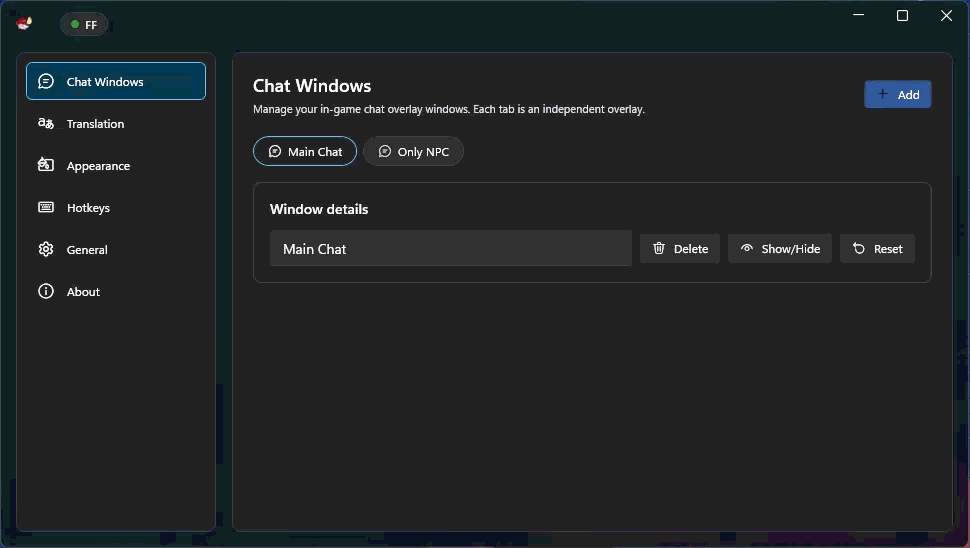

# Tataru Helper

> Aviso de fork: este repositório é um fork com manutenção ativa.
>
> - Repositório original: https://github.com/NightlyRevenger/TataruHelper

 

## [Baixar Agora](https://github.com/progneo/TataruHelper/releases/latest)( \---> Baixar Setup.exe)

## [Servidor do Discord da Tataru](https://discord.gg/bSrpbd9)

* * *

 

## [Demonstração](https://youtu.be/7HiQXzmkQuw)

## [Doações](https://github.com/progneo/TataruHelper/blob/master/README.md#support)

* * *

## Índice

* [Português Brasileiro](#Português-Brasileiro) 
   * [Instalação](#Instalação)
   * [Como usar](#Como-usar)
   * [Desenvolvimento/Tradução](#DesenvolvimentoTradução)
   * [Licença](#Licença)
   * [Créditos](#Créditos)
   * [Contatos](#Contatos)
   * [Suporte](#Suporte)

* * *

#### Português Brasileiro

Desenvolvido por Tataru's Team

Tataru Helper - aplicativo para tradução de textos in-game no MMORPG desenvolvido no Japão - Final Fantasy XIV. Subentenda textos como MSQ, cinemáticas, missões, falas de NPCs, etc.

- Você pode escolher o idioma de origem e destino.
- Você pode mudar livremente o motor do tradutor e usar vários métodos de tradução. 
- Você pode selecionar um chat específico para tradução. 
- Atualizações automáticas.
- Tataru Taru!

## Instalação

Tataru Helper requer:  
Windows 7 **x64** ou posterior (**somente versões x64**).  
[Microsoft. .NETFramework 4.6.2 ](https://www.microsoft.com/net/download/dotnet-framework-runtime)ou superior.  
Final Fantasy XIV versão **DirectX 11** e **x64**.

1. Baixe a versão mais recente do aplicativo de [aqui](https://github.com/progneo/TataruHelper/releases/latest) (Setup.exe).
2. Execute o arquivo Setup.exe. Depois de receber uma mensagem que protegeu seu PC, pressione "mais informações" e execute mesmo assim. O atalho será colocado na área de trabalho.
3. Tataru Helper vai iniciar automaticamente, configurar a linguagem de origem e destino e fazer a configuração inicial.
4. Feche a janela de configurações e arraste a janela flutuante para o lugar desejado.
5. Certifique-se de que as seguintes mensagens estejam selecionadas nas configurações de chat do jogo:  
6. Tudo pronto!  
   P.S. Depois disso, não há mais necessidade de executar o aplicativo através de Setup.exe. Este é o instalador! O atalho para iniciar a aplicação está na área de trabalho ou no menu Iniciar.

## Como usar

- Guia aprofundado [aqui](./Guide.MD).

## Desenvolvimento/Tradução

Quer contribuir? Ótimo!

Se você quer ajudar a traduzir o aplicativo para o seu idioma, clique [aqui](https://crowdin.com/project/tataru-helper).

## Licença

[MIT](/LICENSE)

## Créditos

Muito obrigado a muitos dos que contribuem para projetos de código aberto. Os itens abaixo foram essenciais para o deselvolvimento deste app:  
[WPF Toolkit™](https://github.com/xceedsoftware/wpftoolkit)  
[NHotKey.Wpf](https://github.com/thomaslevesque/NHotkey)  
[NotifyIcon WPF](https://bitbucket.org/hardcodet/notifyicon-wpf/)  
[Sharlayan](https://github.com/FFXIVAPP/sharlayan)  
[Tataru Art by Nezusagi](https://www.deviantart.com/nezusagi)  
[Velopack](https://github.com/velopack/velopack)
## Contatos

Nosso servidor no Discord: [clique](https://discord.gg/bSrpbd9)

Se você tiver alguma dúvida, pode me contatar em:  
Discord: progneo
Telegram: [click](https://t.me/progneo)
Email: prograneo@gmail.com
## Suporte

Se você quer apoiar este projeto, use os links abaixo:  
Boosty: [progneo](https://boosty.to/progneo)

* * *
